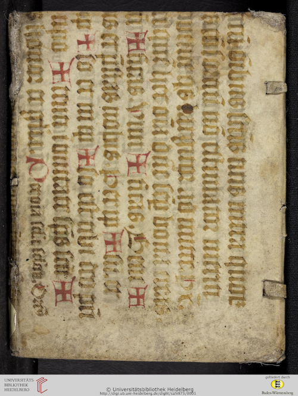
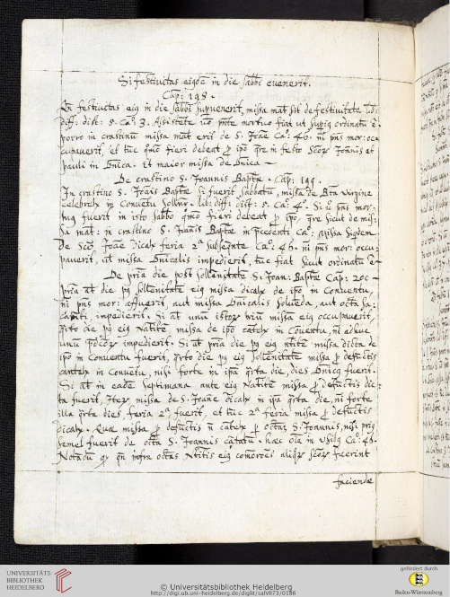

# manuscript-waste-reuse-finder

Code and research description to be presented at the 2024 [Family History Technology Conference](https://fhtw.byu.edu/). Research and Development on a tool to find document images where manuscript waste (a.k.a. binder's waste, somewhat-a.k.a. manuscript fragments) was used to bind other documents. Such reused manuscripts have been found to contain info relating to such diverse fields as genealogy and family history, manuscript studies, paleography, codicology, and of course fragmentology. It will be shown that it is extendable to finding such things as manuscript repairs (e.g. stitching) and iron-gall-ink corrosion.

# Fragment Finder

## Examples of Reused Manuscript Fragments (and of what are not so classified)

Before my description of the tool, I want to put here several images that illustrate Reused Manuscript Fragments. "Reused Manuscript Fragments" will be the term I use to describe what this tool is designed to find. I will also use <b>RMF</b> and such phrases as, "examples of reuse". The images are part of the original dataset.

### Example 1 : Universitätsbibliothek Heidelberg, Codex Salemitana VII,73

Title: _Ordinarium cisterciense_ 

Citation page: https://doi.org/10.11588/diglit.9273#0001

[Public Domain Mark 1.0 Universal (No Copyright)](https://creativecommons.org/publicdomain/mark/1.0/)

[More information (bballdave025's metadata)](./Heidelberg_-_salVII73_URL.txt)

### Example 1.1 : Image Contains Manuscript Reuse Fragment

<b>This is in the positive class.</b>

 

  

 

Binding (front cover) for the main book, _Ordinarium cisterciense_. The fragment appears to come from a large, decorated manuscript. Note the capital letters in red.

### Example 1.2 : Image without any Manuscript Reuse

<b>This is in the negative class.</b>

 

  

 

One of the interior pages of _Ordinarium cisterciense_. One might call this a standard manuscript page.