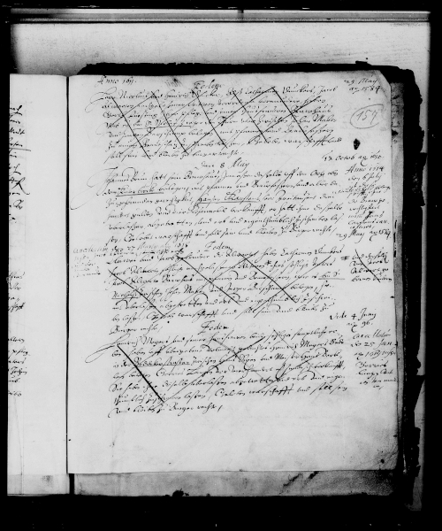

# manuscript-waste-reuse-finder

Code and research description that was presented at the 2024 [Family History Technology Conference](https://fhtw.byu.edu/). It was further published on [Academia.edu](https://www.academia.edu/120229768/Manuscript_Fragments_Reused_in_Bindings_as_Untapped_Genealogical_Sources_Opportunities_for_Family_History_and_Manuscript_Studies_to_Easily_Provide_Information_for_One_Another_All_with_the_Help_of_Machine_Learning) 

It represents Research and Development on a tool to find document images where manuscript waste (a.k.a. binder's waste, somewhat-a.k.a. manuscript fragments) was used to bind other documents. Such reused manuscripts have been found to contain info relating to such diverse fields as genealogy and family history, manuscript studies, paleography, codicology, and of course fragmentology. It will be shown that it is extendable to finding such things as manuscript repairs (e.g. stitching) and iron-gall-ink corrosion.

<b>Edit:</b> Our [initial-findings paper](https://www.academia.edu/120229768/Manuscript_Fragments_Reused_in_Bindings_as_Untapped_Genealogical_Sources_Opportunities_for_Family_History_and_Manuscript_Studies_to_Easily_Provide_Information_for_One_Another_All_with_the_Help_of_Machine_Learning)
is now up on Academia.edu . I'm working on a model that can find lots of types of manuscript re-use as well as some other. 

# Fragment Finder

## Examples of Reused Manuscript Fragments (and of what are not so classified)

Before my description of the tool, I want to put here several images that illustrate Reused Manuscript Fragments in Bindings. "Reused Manuscript Fragments in Bindings" will be the term I use to describe what this tool is designed to find. I will also use <b>RMFB</b> and such phrases as, "examples of reuse". The images are part of the original dataset.

If you're impatient to know about the tool and the accompanying research, you can see my <b>(2024-02-21) UPDATED</b> [paper submitted for a Research Talk](./BLACK-D_and_PRISBREY-K_-_FHTC_2024_-_Reused_Manuscript_Fragments_update_2024-02-21.pdf) as a PDF ([slide deck](RestOfStory_-_MSReuseAsFHInfo.pdf) for the presentation), or you can use this [LINK FOR THE AFTER-IMAGE PART](#Tool-Description-for-the-Family-History-Technology-Workshop). There's also the option of looking at [the model-training code](./fndtnl_cnn_ms_reuse_clssfctn_trn.py).


### Example 1 : Universitätsbibliothek Heidelberg, Codex Salemitana VII,73

Title: _Ordinarium cisterciense_ 

Citation link: https://doi.org/10.11588/diglit.9273

[Public Domain Mark 1.0 Universal (No Copyright)](https://creativecommons.org/publicdomain/mark/1.0/)

[More information (bballdave025's metadata)](./Heidelberg_-_salVII73_URL.txt)


### Example 1.1 : Image of Binding Containing Manuscript Reuse Fragment

<b>This is in the positive class.</b>

<br/>
<div>
  
</div>
<br/>

Binding (front cover) for the main book, _Ordinarium cisterciense_. The fragment appears to come from a large, decorated manuscript. Note the capital letters in red. [Image 1.1 Citation Link](https://doi.org/10.11588/diglit.9273#0001)


### Example 1.2 : Image without any Manuscript Reuse

<b>This is in the negative class.</b>

<br/>
<div>
  
</div>
<br/>

One of the interior pages of _Ordinarium cisterciense_. One might call this a standard manuscript page. [Image 1.1 Citation Link](https://doi.org/10.11588/diglit.9273#0186)


### Example 2 : FamilySearch DGS 007996631 (item 1)

Catalog Record: Hausbücher 1397-1746

Film/Digital Note: 	Hausbücher 1493-1521 Altstadt: Hausbücher 1522-1716

Geographic Location for FamilySearch Catalog: Germany, Mecklenburg-Schwerin, Rostock

Citation:

> No citation is available

(Quoted from the FamilySearch Information Tab in the Record Viewer for this image,) but see [this small note](#Example-2---Appendix-A).


### Example 2.1 : Image of Binding Without Manuscript Reuse

<b>This is in the negative class.</b>

<br/>
<div>
  
</div>
<br/>

A front-cover binding from a Rostock (Germany) Hausbücher. To me, it seems a very cool, antique binding. However, there is no evidence of another manuscript having been used to help protect the book.


### Example 2.2 : Image of Binding Pastedown Without Manuscript Reuse

<b>This is in the negative class.</b>

<br/>
<div>
  
</div>
<br/>

This inside part of the cover is called a pastedown. It's used to help keep the wrapping parts of the binding in place as well as to reinforce the binding's protection of the book. This one shows no trace of being reused manuscript.


### Example 2.3 : Image without any Manuscript Reuse

<b>This is in the negative class.</b>

<br/>
<div>
  
</div>
<br/>

This is another standard manuscript page. It comes from the same book as the previous two images.


### Example 2.4 : Image without any Manuscript Reuse

<b>This is in the negative class.</b>

<br/>
<div>
  
</div>
<br/>

This is another standard manuscript page. It comes from the same DGS - though not the same book, as the previous three images.


### Example 2 - Appendix A

There was no official citation for this document. However, the microfilm's information board has the following:

```
STAATL. ARCHIVVERW. DER DDR
RAT DES BEZIRKES ROSTOCK
GENEALOGISCHE DOKUMENTE
STADTARCHIV ROSTOCK
RAT. STADTBUCHER
1-3.1 45
```

While the GDR is no longer extant, nor is its State Archive Management department, I imagine the Rostock City Archives still exist.


### Other Examples, whose citation and usage I have, but don't have time to write up.

<b> Positive (has reuse), Rear Pastedown, Bibliothèque Nationale de France. Ms French 837</b>

<br/>
<div>
  
</div>
<br/>

This looks like it might be a land-grant, or perhaps a deed, or perhaps I'm way off. This is the right-hand side of what makes up the pastedown - part of the original document was obviously cut off on the right. The left-hand side of what's left is the front pastedown. 

<hr/>

<b> Positive (has reuse), Binding Reinforcers, FamilySearch DGS 4535287 frame 182</b>

<br/>
<div>
  
</div>
<br/>

This is a document from Sweden. The reuse in in those four, detached binding strengtheners, which would have originally glued to the wood on the left-hand side. Look closely (maybe click on the image to see a larger version) and you can see the writing. The writing on the very left of the image - what's wrapped over from the front binding - is also reuse and is much more visible to me.

<hr/>

<b> Positive (has reuse), Outside Binding - Front and Back, FamilySearch DGS 4535287 frame 360</b>

<br/>
<div>
  
</div>
<br/>

<hr/>

<b> Positive (has reuse), Front Binding, FamilySearch DGS 8104286 frame 897</b>

<br/>
<div>
  
</div>
<br/>

This is the first such image I saw in the FamilySearch collections. I was taking an online class in paleography and codicology (manuscript studies) while working at the Granite Mountain Records Vault, and this was an image on one of the microfilms I digitized. If I understand correctly, it has readings and music for a specific Mass.

<hr/>

## Tool Description for the Family History Technology Workshop

I am working on a tool, now informally referred to as "Fragment Finder", that will open up new sources of names, dates, etc. applicable to family history. These interesting and useful fragments will be defined and discussed in the second paragraph. The purpose of this tool is to take large numbers of document images from archives, libraries, and collections and find those images which contain reused manuscript fragments. The prototype tool consists of a Neural-Network model created by using transfer learning from ResNet-50. The fragment images used to train and test the tool were retrieved from FamilySearch as well as from university and national libraries. We – I and Keith Prisbrey, who deferred to me for this presentation – used a labeled dataset of 622 images, of which approximately 1 in 10 showed fragments. After training, our accuracy on the test set was 96.77%. Our tool, with continued development and training, will permit finding reused manuscript fragments.

Manuscript fragments are, quite simply, pages or groups of pages which have handwriting on them, but which do not contain the complete original work. The present tool is especially concerned with single pieces of so-called waste parchment – or even waste paper – that were reused to make bindings or book covers for new codices/books. Some reused manuscript fragments originated from fancy, expensive, and literary sources called Decorated or Illuminated Manuscripts – the Book of Kells being one conspicuous example. Others include contracts, arrest records, deeds, land-grants, notes of debts due to the bookmaker, and other records that include names, dates, locations, professions, and relationships.


## Useful Commands for Dave

### Rename

```bash
find . -type f -iname "*.png" > fnames.lst; \
echo -e "\n\n  $(date +'%s_%Y-%m-%dT%H%M%S%z') \n" | tee -a rename.out; \
find . -type f -iname "*.png" -print0 | \
xargs -I'{}' -0 bash -c '
orig="{}";
echo;
echo "orig: ${orig}";
my_first=$(echo "${orig}" | \
  sed '"'"'s#^[.]/\(.*\)p\([0-9]\+\)[-][0-9]\+\([.]png\)$#\1#g'"'"');
echo "my_first: ${my_first}";
my_end=$(echo "${orig}" | \
  sed '"'"'s#^[.]/\(.*p\)\([0-9]\+\)[-][0-9]\+\([.]png\)$#\3#g'"'"');
echo "my_end: ${my_end}";
my_second=$(echo "${orig}" | \
  sed '"'"'s#^[.]/\(.*p\)\([0-9]\+\)[-][0-9]\+\([.]png\)$#\2#g'"'"');
echo "my_second: $my_second";
my_num=0;
my_unpad=$(echo "${my_second}+1" | bc);
echo "my_unpad: ${my_unpad}";
my_num=0;
if [ $my_unpad -lt 10 ]; then
  my_num="0000${my_unpad}";
elif [ $my_unpad -lt 100 ]; then
  my_num="000${my_unpad}";
elif [ $my_unpad -lt 1000 ]; then
  my_num="00${my_unpad}";
elif [ $my_unpad -lt 10000 ]; then
  my_num="0${my_unpad}";
else
  my_num="${my_unpad}";
fi;
echo "my_num: ${my_num}";
new_fname="${my_first}${my_num}${my_end}";
echo "  Command will be:" | tee -a rename.out;
echo "mv \"${orig}\" \"${new_fname}\"" | tee -a rename.out;
echo "    ..." | tee -a rename.out;
mv "${orig}" "${new_fname}" \
  && echo -e "        ... success\n" | tee -a rename.out \
  || echo -e "        ... FAILURE\n" | tee -a rename.out
'
```

### Convert Commands

#### 0

```bash
identify \
  -format "
      \n\n%f\n%[magick] %[colorspace] %[type]
              %[extension] %[bit-depth] %[channels]\n
" \
  *.tiff # e.g.
```

#### 1

```bash
magick mogrify -colorspace srgb -type truecolor *.jpg
```

#### 2

```bash
mogrify -format jpg -quality 92 -colorspace srgb -type truecolor *.png
```

#### 3

```bash
mogrify -format jpg -quality 92 *.tiff
```

#### 4

```bash

# hopefully it's faster when not working on files on the external hard drive
```

### Oft-used files


## Details of the Model

Coming soon!

For now, you're welcome to look at my <b>(2024-02-21) UPDATED</b> [paper submitted for a Research Talk](./BLACK-D_and_PRISBREY-K_-_FHTC_2024_-_Reused_Manuscript_Fragments_update_2024-02-21.pdf) as a PDF. I think the [slide deck for my presentation](RestOfStory_-_MSReuseAsFHInfo.pdf) (also as a PDF) is even more informative, and it has lots more pictures.

You're also welcome to have a look at [the model-training code](./fndtnl_cnn_ms_reuse_clssfctn_trn.py).
